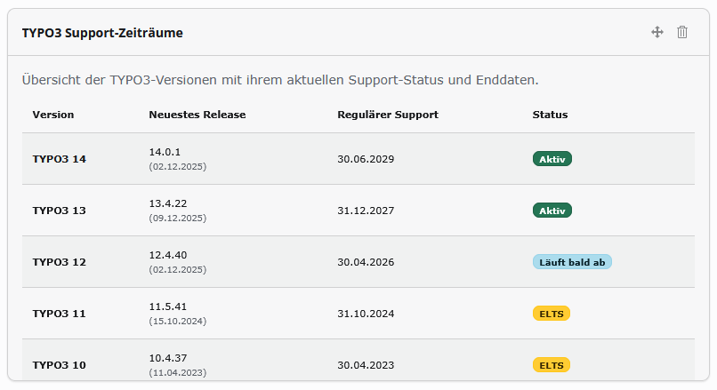
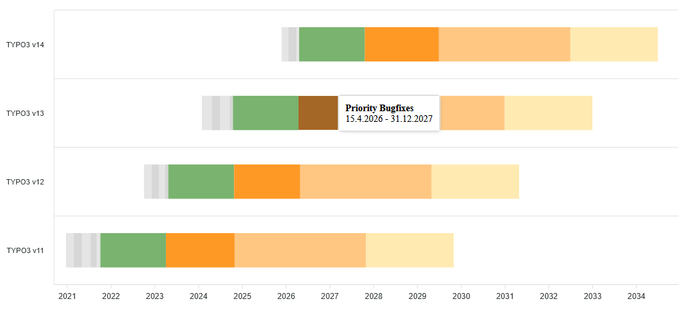

# TYPO3 Support Times (nt_supporttimes)

Display TYPO3 support times, lifecycle information, and interactive roadmap charts in both the TYPO3 backend and frontend.

## Features

### Dashboard Widget

- **Support Status Overview:** Shows all TYPO3 major versions with their current support status
- **Color-coded Badges:** Visual indicators for Active, Expiring, ELTS, and Expired versions
- **Scrollable Table:** Access all versions including legacy releases
- **Multilingual:** Full English and German translations

### Frontend Roadmap Plugin

- **Interactive Timeline Chart:** Visual roadmap using ApexCharts
- **Support Phases:** 
  - Sprint Releases (gray phases before LTS)
  - Regular Maintenance (green - ~18 months)
  - Priority/Security Support (orange)
  - ELTS Support (light orange)
  - Extended Partner Support (beige - +2 years)
- **Configurable:**
  - Chart height adjustable via FlexForm
  - Version filter (select which TYPO3 versions to display)
- **Planned Releases:** Shows future TYPO3 14 sprint releases with estimated dates

### Backend Update Notification
- **Outdated-Version Warning:** Compares the installed TYPO3 version with the latest patch release of its major branch
- **System Information Toolbar:** Shows a warning badge and message next to the TYPO3 version when an update is available
- **Direct Link:** Message links to the release notes on get.typo3.org
- **Fail-safe:** Skips silently when the TYPO3 API is unreachable

### Data & Performance
- **Live API Data:** Fetches from official TYPO3 sources (get.typo3.org)
- **Smart Caching:** Configurable cache lifetime (default: 24 hours)
- **Automatic Updates:** Planned releases are replaced by actual data when available

## Installation

### Composer
```bash
composer require netthinks/nt-supporttimes
```

### Manual
1. Download from TER or GitHub
2. Install via Extension Manager
3. Activate the extension

### Include TypoScript
1. Go to **Template** module
2. Edit your Root TypoScript Record
3. Include static template **Support Times (nt_supporttimes)**


## Configuration

### Extension Settings
Configure in **Admin Tools → Settings → Extension Configuration → nt_supporttimes**:

- **Supported Versions:** Comma-separated list (e.g., `9,10,11,12,13,14`)
- **Show ELTS:** Enable/disable ELTS information display
- **Cache Lifetime:** Seconds to cache API data (default: 86400)

### Plugin Configuration (FlexForm)
When adding the roadmap plugin to a page:

- **Display Versions:** Select which TYPO3 versions to show in the chart
- **Chart Height:** Set custom height in pixels (default: 350px)

## Usage

### Dashboard Widget
1. Navigate to **Dashboard** module
2. Click **+ Add Widget**
3. Select **TYPO3 Support Status**
4. Widget displays current support information for all configured versions

### Frontend Roadmap
1. Create a new content element
2. Select **Plugins → TYPO3 Support Times**
3. Configure display options in the **Plugin** tab
4. Save and view the interactive timeline on your page

## Requirements

- **PHP:** 8.2+
- **TYPO3:** 12.4 LTS, 13.4 LTS, or 14.x
- **Dependencies:** 
  - TYPO3 Dashboard (for widget)
  - ApexCharts (included locally, no CDN - privacy-friendly)

## Multilingual Support

Complete translations available for:
- **English** (default)
- **German** (Deutsch)

All labels, tooltips, and chart phases are fully translated.

## Technical Details

- **Modern TYPO3 APIs:** Uses Extbase, Fluid, PSR-14 events
- **Dependency Injection:** All services configured via Services.yaml
- **Responsive:** Charts and tables adapt to different screen sizes

## License

GPL-2.0-or-later

## Author

NET.THINKS
https://www.netthinks.com   

## Support

For issues, feature requests, or contributions, please visit the GitHub repository or TYPO3 Extension Repository.
